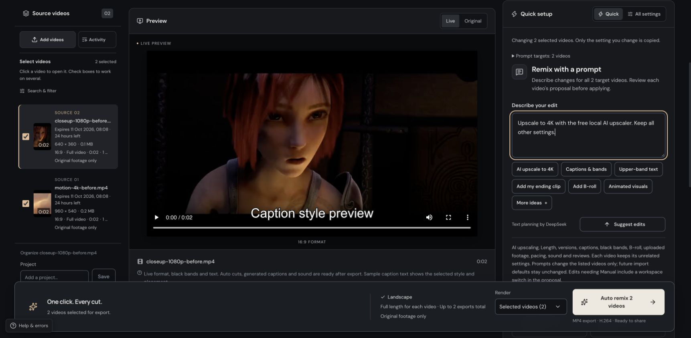
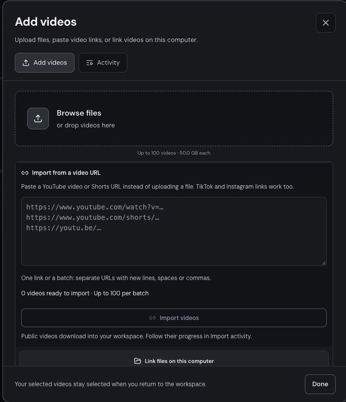
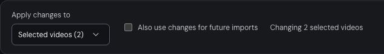
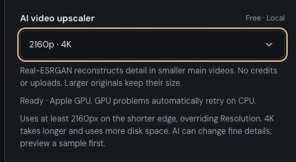
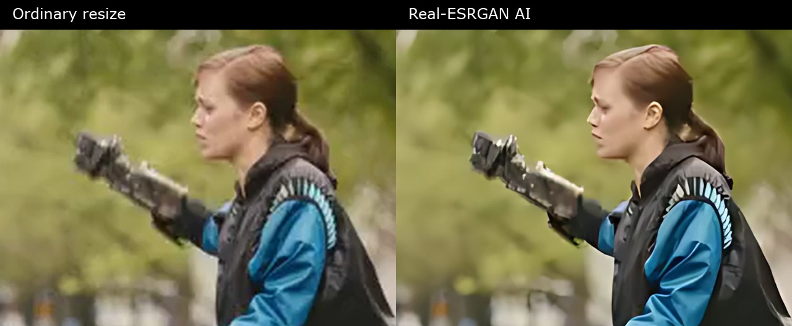
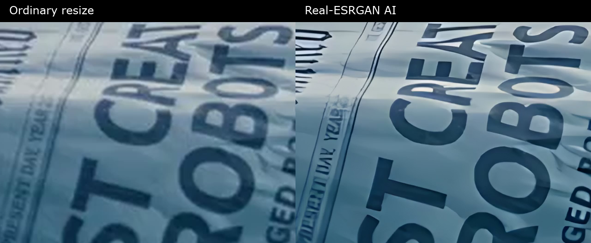
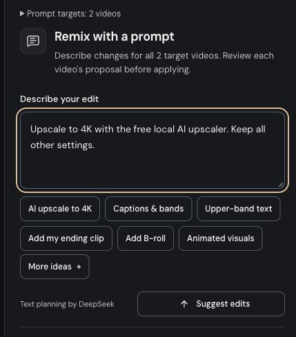
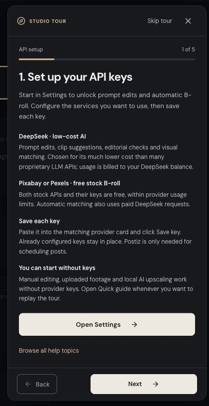

# Remix Studio

**Turn your footage into finished videos, individually or in bulk.**

Remix Studio is a video repurposing app for creators, editors, and teams making content for TikTok, Instagram Reels, YouTube Shorts, and other formats. Import recordings, keep them full length or find shorter moments, add captions and footage, upscale with free local AI, and export ready-to-share MP4s.

Work through the visual editor, describe changes in a prompt, or connect Claude Code, Claude Desktop, or Codex through the local MCP server. The **free standalone URL Downloader** is an extra utility outside the core SaaS editing workflow; it saves videos without creating an editing project.

**Current deployment:** a private, self-hosted installation. Media processing runs on the computer hosting the app, with optional external AI and publishing services. The repository does not include user authentication, customer billing, or tenant isolation for a public SaaS.

[Features](#what-you-can-do) · [AI upscaler](#upscale-videos-with-free-local-ai) · [Quick start](#quick-start) · [AI and costs](#ai-integrations-and-costs) · [Claude / Codex MCP](#edit-from-claude-or-codex) · [Docker](#run-with-docker) · [Full user guide](docs/user-guide.md)



*The actual Auto workspace with sample footage. Focused screenshots below show the controls at a readable size. [Screenshot details and footage credits →](docs/screenshots/README.md)*

## Choose your workflow

| Workflow | What it does |
| --- | --- |
| **Auto remix** | Prepare a batch quickly. Keep complete videos or let Auto choose excerpts, then apply your captions, framing, sound, and finishing preferences. |
| **Manual** | Choose exact cuts and adjust framing, speed, color, sound, captions, overlays, and added footage. |
| **Short clips** | Turn long recordings into approved short drafts using timestamps, transcript selections, or AI suggestions. |
| **Edit this result** | Refine an existing export on a timeline and render a new revision while retaining the previous result. |
| **AI upscaler** | Enlarge main footage to 1080p, 1440p, or 4K with free local Real-ESRGAN. Apply it individually, in bulk, or through a prompt. |
| **Local MCP** | Let Claude or Codex import local media, prepare bulk edits, append footage, render, and check results. |

**Free standalone extra:** the [URL Downloader](#download-videos-without-editing) saves full videos from YouTube, YouTube Shorts, TikTok, and Instagram, individually or as a bulk ZIP. It operates separately from the editing workflows above.

## What you can do

### Import a video or a whole library

- **Upload or drag and drop files.** Drop one or several videos anywhere in the **Source videos** panel, including over existing cards. The panel highlights, then opens import progress. Source imports support resumable uploads, with defaults of **100 videos per batch**, **50 GiB per file**, and **200 sources** in the workspace.
- **Paste video links.** Import YouTube videos and Shorts, TikTok videos and share links, and Instagram Reels/video posts. Mix supported platforms in one batch.
- **Link large local originals.** Read recordings from absolute paths without making another full copy. Keep those originals in place while editing.
- **Manage background work.** Follow preparation, retry failures, cancel imports, and resume interrupted uploads. URL downloads run on the server; browser file uploads need the tab to remain open.
- **Organize sources by project** and search or filter your library.

Supported source containers include MP4, MOV, M4V, WebM, MKV, AVI, and MPEG, with recordings up to 24 hours long. Browser preview support also depends on the codec. [Import details and limits →](docs/user-guide.md#import-long-recordings)



### Apply changes to selected videos

In the workspace, check the source videos you want to change, then choose **Apply changes to → Selected videos**. The scope selector also offers **This video** and **All videos**. Future-import defaults have their own checkbox.



**Auto Quick setup and All settings share the same bulk controls.** You can change formats, captions, black bands, sound, pacing, and other preferences across a selection while preserving unrelated settings.

For example, to add the same ending to ten videos:

1. Import the ten videos and check their source cards.
2. Choose **Apply changes to → Selected videos**.
3. Open **Add my own footage** and upload the ending clip.
4. Enable **Add the whole clip at the end**.
5. Render the selected videos. Each receives the clip after its own ending.

**Apply footage to selected videos** can also explicitly copy the displayed placements. Bulk changes offer undo. Footage placements and watermark masks have their own scope rules; they are not silently saved as future-import defaults. [Bulk editing and draft behavior →](docs/user-guide.md#drafts-review-queue-and-library-browsing)

### Let Auto prepare the edit

Auto starts with **Quick setup**, with **All settings** available for finer control.

- Keep the **full video**, preserving its sequence and length, or choose a **maximum excerpt length** for shorter edits. Inserted footage adds to the final duration.
- Choose portrait **9:16**, Instagram feed **4:5**, square **1:1**, landscape **16:9**, or original framing.
- Request up to **10 versions per source** using different moments, or up to four angles on the same moment: classic, conclusion first, question first, and key points.
- Transcribe locally, add timed captions and opening text, adjust pauses, and balance sound. Keep the original voice or use optional local narration on macOS.
- Choose **Original, Natural, Tight, or Custom** pacing. Save reusable caption, band, pacing, and sound preferences with **My style** and named finishing presets.
- Use optional AI editorial checks and bounded repair attempts, with notes explaining fallbacks, reused excerpts, and unresolved findings.

Version counts are maximums, not a promise of that many distinct usable clips. Without a usable AI key, Auto still has built-in selection; speech-based features also need the local transcription model. [Auto workflow →](docs/user-guide.md#auto-workflow)

### Edit precisely in Manual or Short clips

**Manual** provides trims and cut sequences, speed, volume, replacement audio, crop and zoom, subject positioning, aspect ratio, color looks, sharpening, noise controls, frame blending, mirroring, hooks, captions, and output resolution/frame rate. Sound looks and individual audio modifiers run locally through FFmpeg. Render a five-second sample to check effects before exporting.

**Short clips** is designed for podcasts, interviews, tutorials, and long recordings:

- Build each short from one or more source intervals and rearrange their order.
- **Edit with the transcript:** click words to seek, select speech to create a short, add it as a sequence, or remove it from the edit.
- **Find my best clips:** ask for up to 20 suggestions with a brief and length range, inspect the context, and keep the suggestions you like. This requires local transcription and DeepSeek.
- Review pause and optional filler-removal suggestions, listen around each cut, and undo pacing changes.
- Choose a single frame, two people stacked, or a full scene above a speaker close-up. Optional local face tracking and active-speaker tracking help keep the subject framed.
- Approve drafts individually or in bulk, then render the approved selection.

[Manual controls →](docs/user-guide.md#manual-editing) · [Short clips and transcript editing →](docs/user-guide.md#long-video-to-short-clips)

### Style captions, black bands, and text

- Generate speech captions locally or import SRT subtitles. Captioned exports also provide downloadable SRT files.
- Start with **Clean, Punch, Editorial, or Box**, then customize font, size, color, outline, shadow, alignment, spacing, and background.
- Use bundled **TikTok Sans, Poppins, Anton, and DM Serif** fonts, including supported Cyrillic characters.
- Highlight each word as it is spoken. Optional **Cyrillic lookalikes** apply a visual spelling effect to selected words or all added caption text; this is not translation.
- Add adjustable **black bands above and below the picture**, with separate persistent text, color, size, and spelling controls for each band.
- Keep the whole picture inside the bands or crop it to fill the available window.
- Avoid duplicate captions with local OCR detection, keep the source's existing captions, or explicitly request new ones. Text already baked into the source cannot be restyled as an editable caption.

[Caption appearance →](docs/user-guide.md#caption-appearance) · [Black bands and text →](docs/user-guide.md#black-bands-and-text)

### Add your own footage, stock, and animated explainers

Upload intros, outros, demonstrations, or B-roll and place them in the edit:

| Placement | Result |
| --- | --- |
| **Whole clip at the end** | Append the complete clip after each video's own ending. Multiple ending clips play in order. |
| **Insert** | Add a selected segment and extend the edit. Choose the inserted clip's audio or mute it. |
| **Cover** | Replace the picture for a chosen interval while keeping the main soundtrack. |

Choose crop or contain framing for each placement. Auto supports copying these placements across selected videos; Short clips can apply footage to its drafts.

Optional supporting visuals can combine **your B-roll library**, free stock footage from **Pixabay** and **Pexels**, and locally rendered **HyperFrames / Remotion** animations. Both stock APIs are free within their usage limits; AI matching uses paid DeepSeek requests. Request a shot count and coverage limit. Stock selection checks relevance and motion, retains creator credits, and reports when suitable shots are unavailable. Animated explainers can illustrate processes, comparisons, or numbers grounded in the spoken content.

Supporting visuals are **off by default**. Stock matching and semantic animation planning use DeepSeek; the animation rendering itself runs locally. [Footage placement →](docs/user-guide.md#place-your-own-footage) · [Supporting visuals →](docs/user-guide.md#optional-b-roll-and-animated-cards)

### Remove selected visible overlays

**Watermark removal** is available in **Auto Quick setup**, **Auto All settings**, and **Manual**, and starts off.

Select a rectangle or paint a mask, erase parts of the selection, and undo changes. Apply a fixed area to the whole video or use timed areas only while an overlay is visible. Choose local **LaMa reconstruction**, fast surrounding-pixel blending, or a patch copied from a clean frame. Render a three-second preview before committing to an export.

Masks belong to individual sources and do not copy through bulk settings or presets. Timed areas are fixed within their ranges, rather than automatically following a moving watermark. [Setup, controls, and limitations →](docs/user-guide.md#watermark-removal)

### Upscale videos with free local AI

Use **Real-ESRGAN** to reconstruct detail in smaller main videos and export at **1080p, 1440p, or 4K (2160p)**. Upscaling runs on the computer hosting the app, with **no API key, subscription, credits, or video upload** required for the upscaler itself.



*This screenshot is from an Apple Silicon Mac. The readiness message shows the device available on your host.*

Install once on the computer hosting the app:

```bash
npm run setup:upscale
```

To upscale a batch:

1. Import your videos and check their source cards.
2. Choose **Apply changes to → Selected videos** (or **All videos**).
3. Set **AI video upscaler** to **1080p**, **1440p**, or **2160p · 4K**.
4. Render the selected videos through the usual export controls. Each keeps its unrelated settings.

The control appears in Auto Quick setup, All settings, Manual, Short clips, and the saved-result editor. It follows **This video / Selected videos / All videos** in Auto and Manual, and is saved with finishing presets. You can also ask **“Upscale these videos to 4K with local AI”** in Auto, Manual, or saved-result prompts. Review and apply the proposal, then render. **Prompt planning uses your configured DeepSeek key**; choosing the upscaler directly or updating local MCP drafts with `upscale: "2160"` does not.

**Inspect the details.** These comparisons use the app's actual exports: ordinary Lanczos resizing on the left, Real-ESRGAN on the right. Each pair shows the same frame and the same 640 × 480 crop at the output resolution. The PNG stills have no extra sharpening, blur, or JPEG compression. Click an image to see the crop in motion.

**Live action · 360p → 1080p.** Look at the jacket folds and the metallic arm's outline. Edges are cleaner, while skin and background textures become smoother too.

[](docs/upscale-examples/live-action-1080p-comparison.mp4)

[Input 360p](docs/upscale-examples/live-action-1080p-before.mp4) · [Ordinary resize 1080p](docs/upscale-examples/live-action-1080p-resize.mp4) · [AI result 1080p](docs/upscale-examples/live-action-1080p-ai.mp4)

**Printed edges · 540p → 4K.** Inspect the letter outlines and paper folds. Sharper edges do not guarantee accurate text reconstruction; small letters can remain distorted.

[](docs/upscale-examples/print-4k-comparison.mp4)

[Input 540p](docs/upscale-examples/print-4k-before.mp4) · [Ordinary resize 4K](docs/upscale-examples/print-4k-resize.mp4) · [AI result 4K](docs/upscale-examples/print-4k-ai.mp4)

Open `docs/upscale-examples/index.html` locally for an interactive before/after slider, comparison videos, and the earlier animated examples where the improvement is subtler. **These are controlled demonstrations:** 2.5-second excerpts of *Tears of Steel* were cropped to 16:9, reduced to 360p/540p and compressed at H.264 CRF 26 before upscaling. Both sides use the same input and final H.264 encoding settings. They illustrate selected cases, not an average quality guarantee for recordings. Footage: (CC) Blender Foundation | [mango.blender.org](https://mango.blender.org/sharing/), [CC BY 3.0](https://creativecommons.org/licenses/by/3.0/). [Render details and exact crops](docs/upscale-examples/manifest.json). Run `npm run examples:upscale` to reproduce all examples.

The free [Real-ESRGAN](https://github.com/xinntao/Real-ESRGAN) `realesr-general-x4v3` model reconstructs the selected main footage locally, before added captions and overlays. Apple Silicon uses the GPU through PyTorch MPS; CPU execution is also supported.

The installer targets 64-bit Windows/Linux and Apple Silicon on macOS 14+. Python 3.10–3.13 is supported (3.12 recommended). A dedicated graphics card is optional: GPU failures retry the same frame using CPU AI, and memory pressure reduces tile size automatically. The control shows the device after a real startup check. Run `npm run check:upscale` to diagnose setup or `npm run check:upscale -- --device cpu` to test CPU operation. Intel Macs, 32-bit systems, and native Windows ARM Python are not supported by the current dependency wheels. [Compatibility and troubleshooting →](docs/user-guide.md#upscaler-compatibility)

Targets specify a minimum shorter edge while keeping the chosen aspect ratio; enabling AI upscaling overrides ordinary Resolution and does not shrink larger native pictures. The model reconstructs up to 4×; larger requested enlargements use a final resize. Supporting shots, inserted footage, and graphics are fitted normally rather than passed through the model. AI estimates details and may change textures or flicker between frames. Preview a short sample first. Bulk jobs share one inference slot to bound GPU memory, and temporary reconstructed video files are removed after completion or cancellation. [Details →](docs/user-guide.md#ai-video-upscaling)

### Describe edits in a prompt

Use **Remix with a prompt** in Auto, **Edit with a prompt** in Manual, or the prompt editor inside a saved result.

Examples:

> “Upscale these videos to 4K with local AI. Keep all other settings.”
>
> “Keep the full video, add black bands, and append outro.mp4 in full.”
>
> “Use TikTok Sans captions, white text, and highlight each spoken word.”
>
> “Use 01:10 to 01:35, make it a little warmer, and mute the audio.”
>
> “Put ‘Three things to remember’ in medium white text in the upper band.”



Review the proposed changes before applying them, then render through the normal controls. Auto prompts follow the selected-video scope and show changes for each target; a failed or ambiguous proposal leaves the batch unchanged. Manual prompts change the current video, with copy controls available afterward. Upload any named footage first.

Prompt editing uses your configured DeepSeek key. Applying a proposal does not start an export. [Prompt workflow →](docs/user-guide.md#edit-with-a-prompt)

### Refine exports on a timeline

Open **Edit this result** to change a saved export without starting from scratch. Drafts autosave, and rendering creates a new revision while preserving the original export.

The timeline follows the complete edit, including inserted footage and outros. Reorder and trim clips, split at the playhead, insert footage, copy/cut/paste selections, inspect the audio waveform, and undo or redo changes. Keyboard controls follow familiar Final Cut Pro conventions, with Command on macOS and Ctrl on Windows/Linux.

Adjust captions, hooks, framing, cuts, and supporting shots; compare the live draft with the saved export. Final sound processing and some effects require a rendered sample or export. [Result editing and shortcuts →](docs/user-guide.md#faster-export-editing-and-review)

### Review, export, and keep a useful history

- Follow queued and running jobs, cancel work, and retry failures. Recoverable render interruptions retry with a bounded budget that survives restarts.
- Preview finished MP4s, download them individually, or select exports for a ZIP with available SRT captions and export information.
- Mark results **Accepted**, **Needs edits**, or **Rejected**. Use the full-window quick-review player and download accepted clips together.
- Inspect separate technical, editorial, and sampled picture/sound checks. Open timestamped findings and stage corrections in a new revision.
- Use **Keep** to protect completed exports and their editing files from automatic expiry.
- Browse **History** by project, source, format, dates, decision, or publication state. Inspect saved settings, revisions, source intervals, and possible earlier uses of similar footage.
- Record posts and measured outcomes, compare settings, and export measurement data as JSON/CSV. These records describe observed results; they do not establish what caused them.

Every newly rendered export strips source metadata, chapters, and software tags, including after captions are added. Only neutral playback information remains, and a final check verifies cleanup. This does not remove marks encoded into the image or soundtrack. [History →](docs/user-guide.md#export-history) · [Finished picture and sound review →](docs/user-guide.md#review-the-finished-picture-and-sound)

### Prepare post copy and schedule publication

Create reusable promotion profiles manually or import an **App Store / Google Play listing**. Review the saved product facts, audience, benefits, language, country, and call to action.

From a finished export, generate editable **short and long captions**, titles, and relevant hashtags. Choose the post language independently of its target country. With **Postiz** configured, select connected TikTok, Instagram, and YouTube accounts, review each platform's copy/settings, and schedule to multiple accounts at once.

Scheduling records persist, show per-account success or failure, and support status refresh and cancellation of future posts. Postiz handles publication after confirmation. Hashtags are topical suggestions unless supported by a recent configured evidence feed. [Publishing setup and hashtag feed format →](docs/user-guide.md#app-promotion-copy-and-postiz-scheduling)

### Download videos without editing

The **Downloader** tab is a **free standalone tool**, not part of the core SaaS video-editing workflow. Use it independently to save videos, without creating an editing project or running an AI edit. To import a video into the editing workflow instead, use **Workspace → Add videos**, which supports the same links.

- Paste up to **100 URLs per batch**, including regular YouTube links and **YouTube Shorts**.
- Keep full videos with their original audio. No AI requests or credits are needed.
- **Strip metadata is on by default**; switch it off to save the imported file unchanged. Compatible MP4s can be cleaned without re-encoding; other inputs may need conversion.
- See preparation, platform wait countdowns when available, download progress, and cleanup stages. Retry failures or cancel pending work.
- Download single MP4s, all ready videos, or a selected ZIP. Files remain available for **48 hours**.

Downloader items stay separate from editing sources and exports. Platform access restrictions still apply; login cookies can be configured when needed. [Downloader guide →](docs/user-guide.md#url-downloader--free-extra-tool)

## Quick start

### Requirements

- **Node.js 22.13+** and npm.
- **FFmpeg and ffprobe** on `PATH`, including H.264/AAC encoding, `drawtext`, and `subtitles` support.
- **Python 3.10–3.13** for local speech/face tools; **Python 3.12 is recommended**. The URL downloader accepts Python 3.10+.
- **Tesseract OCR** for detecting captions already present in source footage.
- Disk space for sources, renders, dependencies, and any optional local models.

On macOS with Homebrew:

```sh
brew install node ffmpeg-full tesseract python@3.12
export PATH="$(brew --prefix ffmpeg-full)/bin:$PATH"
```

See the [Linux and Windows setup instructions](docs/user-guide.md#run-locally) for platform-specific details.

### Install and launch

```sh
git clone https://github.com/best-trading-indicator-tools/video-remix.git
cd video-remix
npm ci

# Prepare local speech recognition and URL imports.
npm run setup:auto
npm run setup:imports

npm run dev
```

Open **http://127.0.0.1:5173**. The API runs on port **8787**. Keep the development command running while you use the app.

The first speech setup downloads its model; subsequent transcription uses the cached model locally. You can skip speech setup for basic Manual edits and URL downloads. No API key is needed to start the app.

The first-run tour starts with **API keys in Settings**: DeepSeek provides low-cost, paid prompt editing and AI matching; Pixabay and Pexels provide free stock B-roll APIs. **Open Settings** closes the tour so you can save each key. Keys are optional for local editing and upscaling. The remaining steps cover imports, output settings, review, and MCP. Reopen the tour through **Quick guide**, or use the contextual help for a detailed walkthrough.



For the built app:

```sh
npm run build
npm start
```

Open **http://127.0.0.1:8787**; one server serves the frontend and API.

### Optional local tools

| Command | Enables |
| --- | --- |
| `npm run setup:auto` | Local Whisper transcription, speech captions, and transcript-based editing. |
| `npm run setup:imports` | yt-dlp for YouTube, Shorts, TikTok, and Instagram links. Run again to update platform support. |
| `npm run setup:focus` | Local face detection and speaker-centering support. |
| `npm run setup:speaker` | Local active-speaker tracking using TalkNet; also prepares face detection. |
| `npm run setup:watermark` | Local LaMa reconstruction for selected overlay areas. |
| `npm run setup:upscale` | Free local Real-ESRGAN video upscaling to 1080p, 1440p, or 4K. Check readiness with `npm run check:upscale`. |
| `npm run setup:visuals` | Chromium for local animated cards if browser installation was skipped. |

Model installers need internet access initially. Local model processing has no per-video API charge. Optional generated narration uses installed macOS voices; it is unavailable in Windows, Linux, and Docker.

## AI, integrations, and costs

Manage provider keys in **Settings** or use a private root `.env` based on [.env.example](.env.example). Saved Settings keys override environment keys and can be removed to restore the environment configuration. Changing a saved key does not require restarting the app; environment changes do.

**Pixabay and Pexels are free:** their stock APIs and API keys have no usage charge within provider limits, and footage remains subject to each provider's license. Automatic stock matching still uses separately billed DeepSeek requests. [Pixabay API](https://pixabay.com/service/about/api/) · [Pexels API pricing](https://help.pexels.com/hc/en-us/articles/47677890260761-Is-the-Pexels-API-free-to-use). As of October 10, 2026, Pexels reports that [new API key issuance is paused](https://help.pexels.com/hc/en-us/articles/900004904026-How-do-I-get-an-API-key); start with Pixabay if you do not already have a Pexels key.

**Why DeepSeek?** We chose it to keep AI editing affordable: its API prices are substantially lower than many proprietary LLM APIs, including Claude Sonnet and Opus. DeepSeek is **paid, billed by token usage** against your own account balance. Costs depend on the model, input/output volume and caching; compare the current [DeepSeek rates](https://api-docs.deepseek.com/quick_start/pricing/) and [Claude rates](https://platform.claude.com/docs/en/about-claude/pricing) rather than assuming a fixed saving on every request.

| Service | Used for | What leaves the app |
| --- | --- | --- |
| **DeepSeek** | AI excerpt discovery, text writing, prompt edits, editorial checks/repairs, stock matching, visual planning, and promotion copy. | Relevant text, settings, and—when image checks are enabled—sampled frames. Source audio and full videos are not uploaded for these AI features. |
| **Pixabay / Pexels** | Search and download stock footage. Current stock matching also requires DeepSeek. | Stock search queries; selected assets are downloaded locally. |
| **Postiz** | Schedule posts to connected social accounts. | The finished MP4, reviewed post copy, account selection, and scheduling settings. |

**Local media processing, Real-ESRGAN upscaling, and the URL Downloader do not consume AI credits.** Enabled provider-backed AI steps in an editing or export workflow use your own provider accounts and their applicable charges. A Claude/Codex client may also have its own separate usage costs.

Exports show recorded DeepSeek **input/output tokens**, request counts, model names, and **estimated USD cost**. A separate balance panel retrieves the account's remaining funds and shows when it was checked. This is an account-wide monetary balance, not a separate Remix Studio credit system. Estimates can be incomplete, and prompts made before an export exists are outside that export's total. [Usage accounting details →](docs/user-guide.md#deepseek-usage-and-remaining-balance)

Without DeepSeek, core Manual editing, timestamp-based shorts, local tools, and basic Auto fallback remain available. AI discovery and prompt editing require a key. `AUTO_AI=false` disables Auto planning/checks/repairs; separately requested prompt edits and AI B-roll matching have their own behavior.

## Edit from Claude or Codex

The local **Model Context Protocol (MCP)** server exposes the existing app to installed Claude Code, Claude Desktop, and Codex clients. It does not require publishing a server or deploying a separate API.

After installing the app:

```sh
npm run build
npm run mcp:install
```

Keep Remix Studio running, then restart the client or open a new session. The installer registers `remix-studio` with supported installed clients and preserves their existing settings with backups.

Try:

> “List my Remix Studio videos and available ending clips.”
>
> “Create an Auto draft for these two videos. Keep both full length, add black bands, and append outro.mp4 to both. Show me the draft.”
>
> “Render the draft, check progress, and give me the MP4 download links.”

MCP drafts are shared across local clients and kept separate from browser selections. Direct typed setting changes do not call DeepSeek; the app's prompt tool and enabled AI export features can. Rendered results appear in the ordinary **Exports** tab.

See the [MCP guide](docs/local-mcp.md) for all 18 tools, manual registration, example requests, and troubleshooting.

## Configuration, storage, and hosting

Common settings in [.env.example](.env.example):

| Setting | Default | Purpose |
| --- | --- | --- |
| `HOST` / `PORT` | `127.0.0.1` / `8787` | API and built-app address. |
| `DATA_DIR` | `data` | Workspace database, media, models, and private settings. |
| `MAX_FILES` | `100` | Import batch and unfinished-import capacity. |
| `MAX_LARGE_FILE_SIZE_GB` | `50` | Source import size limit in GiB. |
| `MAX_FILE_SIZE_MB` | `500` | B-roll / multipart size limit in MiB. |
| `RENDER_CONCURRENCY` | `2` | Concurrent export jobs; configurable from 1 to 4. |
| `RETENTION_HOURS` | `24` | Retention for unkept finished exports and unreferenced sources. |
| `WHISPER_MODEL` | `small` | Local speech model; prepare the chosen model before use. |
| `YT_DLP_COOKIES` | Optional | Exported Netscape-format cookies for restricted URL imports. |

Sources, export jobs, saved edit plans, and History persist on the host. Some preferences, presets, and Short clips drafts are browser-local. Keep the workspace data directory and browser data when backing up your installation. **Keep** protects exports and their required editing assets beyond normal retention; Downloader files have their own 48-hour window.

Settings stores API keys encrypted under `DATA_DIR/private/`; keep the encryption key and encrypted key file together in private backups. Keys, media, and cookie files are excluded from Git. See [storage and migration](docs/user-guide.md#workspace-storage-and-migration) for details.

The current installation has **no built-in sign-in or tenant isolation**. Keep its default local binding, or provide your own authenticated access layer for a private deployment. A shared public SaaS needs those boundaries before accepting customer data.

## Run with Docker

The image includes the production app, FFmpeg, fonts, OCR, Chromium, and transcription/download dependencies. A named volume preserves the workspace.

```sh
docker build -t remix-studio .

# Download the speech model into the persistent volume once.
docker run --rm -v remix-data:/app/data remix-studio npm run setup:auto

docker run --rm --name remix-studio \
  -p 127.0.0.1:8787:8787 \
  -v remix-data:/app/data \
  remix-studio
```

Open **http://127.0.0.1:8787**. Configure provider keys in Settings or follow the [Docker environment instructions](docs/user-guide.md#docker). The published port above is private to the host computer. Local file links must reference paths visible inside the container.

## Development

The app uses **React + TypeScript + Vite**, an **Express API**, **SQLite**, and an **FFmpeg background queue**. Speech processing uses faster-whisper; supporting animations use HyperFrames and Remotion.

```sh
npm run typecheck
npm run build
npm test
```

Tests preload an isolated workspace and clear personal provider keys. Media integration tests require FFmpeg/ffprobe; optional model checks need their local dependencies. [Development and CI details →](docs/user-guide.md#development-and-checks)

| Directory | Contents |
| --- | --- |
| `src/` | App interface and editing workflows. |
| `server/` | API, media engine, background jobs, integrations, and MCP. |
| `shared/` | Schemas, settings, edit/timeline logic, and shared types. |
| `scripts/` | Local model installers, processing helpers, and MCP setup. |
| `tests/` | Unit, API, and media integration checks. |
| `docs/` | Detailed user guide, MCP setup, and implementation notes. |
| `benchmarks/` | Media and editorial evaluation tools and results. |

Bundled fonts and local models retain their license notices in [public/caption-fonts](public/caption-fonts/README.md), [scripts/models](scripts/models/README.md), and [TalkNet's license](scripts/vendor/talknet/LICENSE). Dependencies, including the animation renderers, have their own licensing terms.

## Help and reference

- [Complete user guide](docs/user-guide.md): every workflow, advanced settings, and operational details.
- [Troubleshooting](docs/user-guide.md#troubleshooting): imports, FFmpeg, models, narration, captions, and exports.
- [Local MCP guide](docs/local-mcp.md): Claude Code, Claude Desktop, and Codex setup.
- [Configuration template](.env.example): environment settings and optional integrations.
- [Responsive UI notes](docs/responsive-ui.md): desktop, tablet, and mobile behavior.
- [Benchmarks](benchmarks/README.md): quality checks and evaluation methodology.

Inside the app, **Help & errors** keeps recent action reports and provides **Copy error details** for troubleshooting. Nothing is sent automatically.

Use footage you own or have permission to repurpose, and review edits before posting. AI suggestions, spelling effects, and metadata cleanup do not guarantee accuracy, platform acceptance, or reach.
